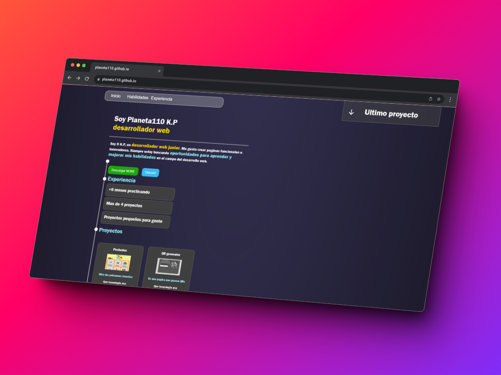

## Planeta WEBSITE
Siéntete libre de revisar cualquier código disponible en este sitio web, incluso si ya ha sido compilado. Aunque no podemos acceder al código fuente original, aún puedes explorar su funcionalidad y comprender cómo está diseñado.

Para ejecutar el código de esta web, es necesario hacerlo en `un entorno de servidor`. Esto implica alojar el código en un servidor que pueda interpretar y ejecutar el código, proporcionando así la funcionalidad necesaria para que el programa opere correctamente. :+1:

### Cosas por acer.

|WEBS|404 STATUS|Pagina principal|Generador contraseña|------|
|-----------|----------|---------|-----|------|
|Porcentaje|  0%     | 92%|35%|------|
|SEO|  0%     | 60% |2%|------|
|Frontend| 0% |95%|50%|------|
|----------|--------|------|-----|------|

# Creditos

Creditos a : `Planeta110` por crear la **web**, Creditos a los `creadores de las imagenes` si incluye alguna imagen de internet.

### Siéntete libre de modificar lo que desees, siempre respetando las leyes y sin excederte en las modificaciones. Si utilizas este trabajo para tu portafolio, puedes atribuirlo a Planeta110.

## No nos hacemos responsables por el uso que hagas de este contenido.Y tampoco si mi web incumple regla por que esto **es una web PARA la comunidad**
